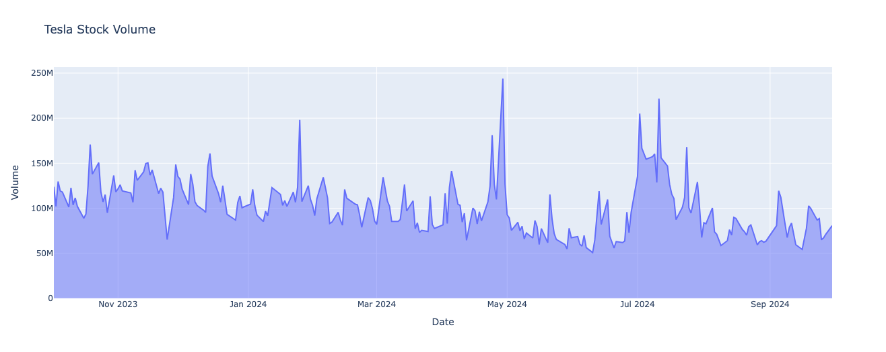
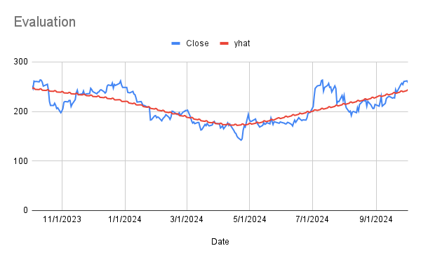

# Tesla Stock Price Prediction using Facebook Prophet

## Objectives
- Build a Facebook Prophet Model & Forecast the stock price (USD) of Tesla 30 days into the future.

- Visualize data using Plotly express & Evaluate Forecast using Google Finance in Google Sheets.

- Automate the stock forecasting process to get the forecast of any stock within seconds.

### Stock Distribution (Oct 2023 - Oct 2024)

### Forecasting Model Evaluation

- Overall Accuracy: The Prophet model appears to have captured the general trend of Tesla's stock price over the year. While there are some discrepancies, especially in the early months, the model's forecasts are generally within a reasonable range of the actual prices.
- Seasonal Patterns: The model seems to have effectively captured the seasonal fluctuations in Tesla's stock price, likely related to factors like quarterly earnings reports, product launches, and market sentiment.

### Predicted 30-Day Close Price

- Overall Trend:

Slight Upward Trend: The predicted price appears to be trending slightly upward over the time period. This suggests a positive outlook for the stock's performance.

- Price Stability:

Minimal Fluctuations: The predicted price exhibits relatively minimal fluctuations, indicating a relatively stable outlook. However, it's important to note that this could be due to the model's assumptions or limitations.

- Starting and Ending Prices:

Price Increase: The price started at 244.54 and ended at 257.28, representing a 5.2% increase over the time period.
